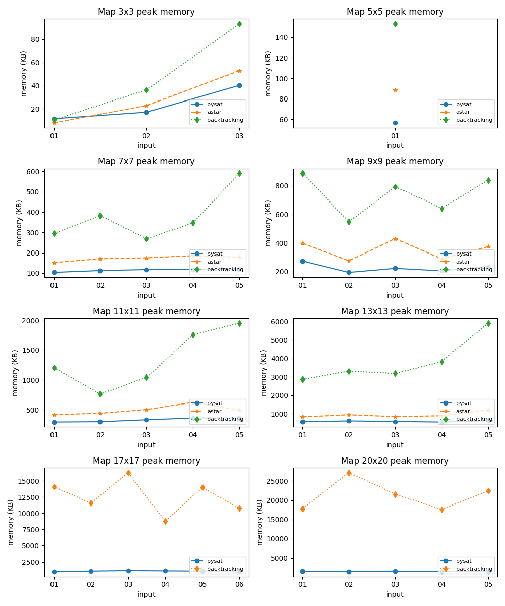

<h1 align="center">Hashiwokakero Solver</h1>
<p align="center" style="font-size:16px"><strong>A Hashiwokakero Solver using PySAT, DPLL, A* and Brute-force with friendly CLI tools for solving and doing benchmark</strong></p>
<p align="center">  
  
</p>

<p align="center">
  
  
  
  
  
</p>

## Features

**Run Solver**

```bash
usage: hashiwokakero [-h] [-v] [-a {pysat,astar,backtrack,brute}] [-i INPUT]

HCMUS AI Foundations -- Hashiwokakero Project

options:
  -h, --help            show this help message and exit
  -v, --version         Version
  -a {pysat,astar,backtrack,brute}, --algo {pysat,astar,backtrack,brute}
                        Choose which algo will be used
  -i INPUT, --input INPUT
                        Path to the input file
```

```bash
uv run main -a pysat -i "./data/input/20x20/input-04.txt"
```
or
```bash
uv run main -a astar -i "./data/input/13x13/input-05.txt"
```

**Run Benchmark**

```bash
usage: hashiwokakero [-h] [-m] [-e]

HCMUS AI Foundations -- Hashiwokakero Project

options:
  -h, --help     show this help message and exit
  -m, --metrics  Export metrics images
  -e, --export   Export result to output
```

```bash
uv run src/benchmark.py -m -e
```

## Tech Stack


## Screenshots

<div style="display:flex;gap:12px;justify-content:center">
	
	
</div>

## Guide

- Read project guide [here](./Source/md/guide.md)
